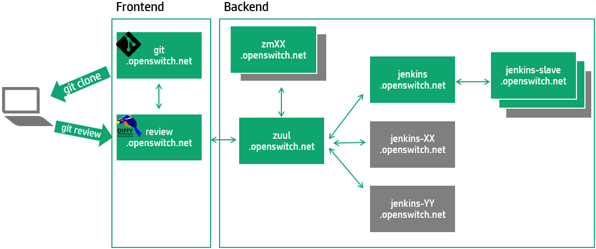

# CIT (Continuous Integration Testing)

## Git and Gerrit
[Git](https://www.gerritcodereview.com/) and [Gerrit](http://code.google.com/p/gerrit/) are used as the version control and review management systems for OpenSwitch.

Contributors initially clone the repository that they want to work with to a local Git repository and once they're satisfied with the changes made, the patchset is sent with the `git review` command to Gerrit for review and validation.

The Gerrit user interface can be accessed via its link: https://review.openswitch.net/

## Jenkins and Zuul
[Jenkins](https://jenkins-ci.org/) and [Zuul](http://docs.openstack.org/infra/zuul/) are used as the Continuos Integration, Scheduling and Gating systems for OpenSwitch.

Zuul manages pipelines. A pipeline is configured to run a series of tests. Zuul compiles code and load balances tests for Jenkins to run. Zuul listens for events from Jenkins and processes the results of the tests.

Currently the pipelines configured are:

1. `Check`: Newly uploaded patchsets enter this pipeline to receive an initial **+/-1** `Verified` vote from Jenkins. The  pipeline includes actions like compiling the changes and making sure that the image does not crash.
2. `Gate`: Changes approved by core developers are enqueued in order in this pipeline, and if they pass tests in Jenkins, will be merged. The pipeline includes regression testing.
3. `Periodic`: Jobs in this queue are triggered on a timer. The pipeline consists on a complete set of test that run regularly to assure the repository is stable.

If the tests don't pass, the CIT system adds a **-1** vote with a comment to the change review. If it is desired that the tests be run again, one of the following can be done. It will cause Zuul to re-schedule the tests.

Using `git`:
* The contributor can make the changes needed and commit them with the `--amend` switch (`git commit --amend`) so that they're added to the same change review. The new changes will show up as a second (or more) patchset under the same Change Review in Gerrit.

Using Gerrrit:
* If the contributor wants the tests to be run again without making any modifications to the patchset (e.g.the failure was not with his code but with Zuul or something else that was fixed separately), the contributor may simply add a comment to the patchset with the word `recheck` in it.

**NOTE**: For jobs that compile source code, only the source code needed for the job is compiled as opposed to the entire project.

The Jenkins and Zuul user interfaces can be accessed by their respective links: https://jenkins.openswitch.net/ and http://zuul.openswitch.net/

## CIT workflow

After a contributor has cloned a project and submitted a patchset using `git-review`, the change goes through a validation process in the Continuous Integration workflow. The following diagram shows a typical workflow:

The current status for all tests currently scheduled or running can be seen at the [Zuul](http://zuul.openswitch.net/) status page.

### Requirements for merging
The following votes needs to be given to the change before it is attempted to be merged:
* A **+2** vote in `Code Review` from a Core Reviewer.
* A **+1** vote in `Verified` from Jenkins.
* A **+1 (Approved)** vote in `Workflow` from the Change Owner.

### Approval process

1. Jenkins runs the `Check` tests for newly updated patchsets.
2. Jenkins reports the results of the tests by leaving a comment and a vote in the `Verified` category. Jenkins votes can be **+/-1** for a succesful/unsucessful test. The results are added to Gerrit with a user called `Zuul`.
3. The Core Reviewers provide  **+/-2** votes for the changes in the `Code Review` category.
4. Once that the change has been voted by a Core Reviewer with a **+2** vote and Jenkins has confirmed that all tests pass with **+1**, the owner approves the change by giving a **+1 Approved** vote in the `Workflow` category. **Change owners should only do this after validating that the changes are desired as this is the last checkpoint before Zuul schedules the `Gate` pipeline prior to the merge process.**

**NOTES:**
* Any developer can review the code changes and leave a message as well as a vote (**+/-1**).
* The change can be `Abandoned` in the Gerrit review site.
* A green checkmark in Gerrit indicates that the change has met the review requirements for that category.

### Merge process
1. Once the change has been approved, Zuul schedules the `Gate` pipeline before merging.
2. If the tests pass, the change gets merged into the project, if the `Gate` tests fail, a message is left by Jenkins and the contributor needs to take action.

### Process feedback
If the tests failed or feedback is received from the community or the Core Reviewers, the contributor should have followed the process described in the [How to contribute](./how-to-contribute.html) guide to amend the changes and re-submit them for review. In a nutshell:

1. The contributor makes the changes and commits them with the `git commit --amend` command so that Gerrit can process them as part of the same Change Request (another patchset within the same change).
2. The contributor sends the changes back for review with `git review`
3. The same process described above for Approval follows.
4. If the `Gate` tests pass, the change is merged into the code base.

## Architecture
The following diagram describes how the different servers integrate with each other.

